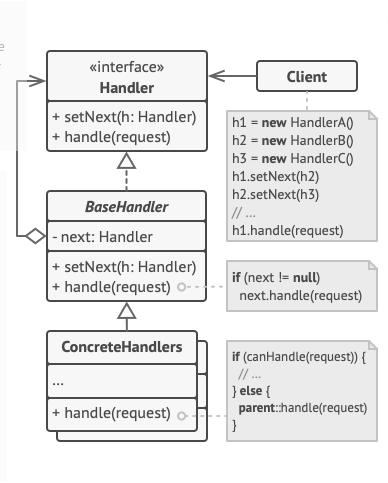

# Design Patterns Chain of Responsability

Esse design pattern trata-se de uma cadeia de responsabilidade, onde dada uma
solicitação de um cliente a solicitação passar por uma serie de manipuladores
até que algum manipulador seja capaz de responder.

# Exemplo de Descontos
Foi criado um [exemplo](./examples/descontos.py) simples, no qual foi aplicado esse pattern para calcular uma cadeia de promoções em um carrinho.