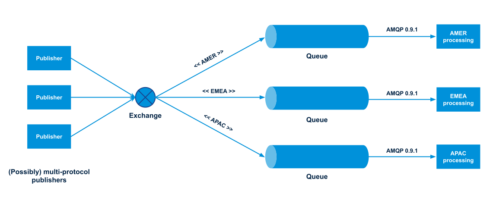

# Design Patterns Publish Subscribe

Esse padrão altera o comportamento do observer de mandar notificações de todos para todos adicionando um
"elemento" no meio que serve como gateway para redirecionar as notificações só para quem interessa.
No exemplo implementado temos basicamente um inscrito que diz que quer receber mensagem de um determinado
topico não importa de que publicador está vindo. A classe gateway faz a união de N publicadores com N inscritos.

Mais do que um padrão de projeto, o pub-sub define uma arquitetura. A ideia do publish subscribe é bastante usada em sistemas de mensagerias.
Abaixo é possível ver um exemplo de um funcionamento do serviço de mensageria do RabbitMQ(retirado do próprio blog deles):

